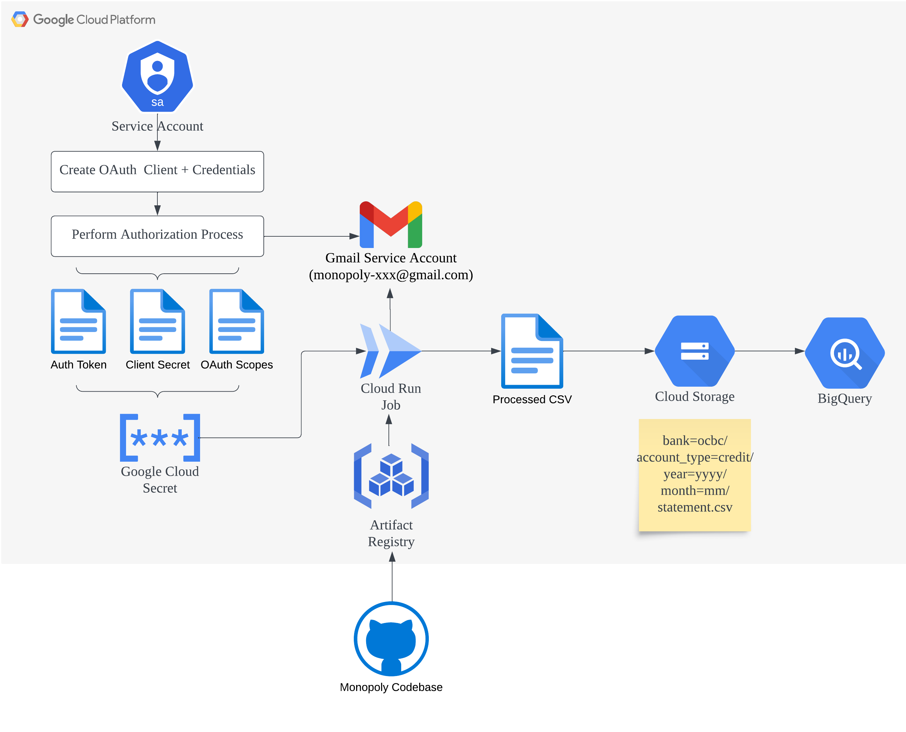

<br>

-----------------

[](https://github.com/benjamin-awd/monopoly/actions)
[](https://github.com/benjamin-awd/monopoly/actions)
[](https://github.com/psf/black)
[](https://github.com/pylint-dev/pylint)
[](https://opensource.org/licenses/MIT)


Monopoly is a Python library that extracts transactions from bank statement PDFs using Tesseract

Supported banks:
- Citibank
- HSBC
- OCBC

Only credit card statements are supported (for now)

## Install
Install dependencies using [Homebrew](https://brew.sh/)
```bash
brew bundle
```

Clone the repo
```bash
git clone https://github.com/benjamin-awd/monopoly.git
```

Create a virtual environment and install Python dependencies
```bash
pyenv virtualenv 3.11.4 monopoly
pyenv shell monopoly
poetry install
```

## Usage
Monopoly can be run as a Python package, allowing you to extract, transform and write bank statements to a CSV file.

To see how Monopoly works, you can run this [example](monopoly/examples/single_statement.py)
```bash
python3 monopoly/examples/single_statement.py
```

If your PDF is encrypted, you'll have to add the password to a .env file in the root directory, which is automatically read by monopoly

You can use the .env.template and then update values in the .env file
```
cp .env.template .env
```

## Features
- Monopoly can be run on Google Cloud as a scheduled Cloud Run job.
- PDFs can be unlocked using explicitly defined passwords and/or a masking pattern like ?d?d?d

Current cloud implementation:


